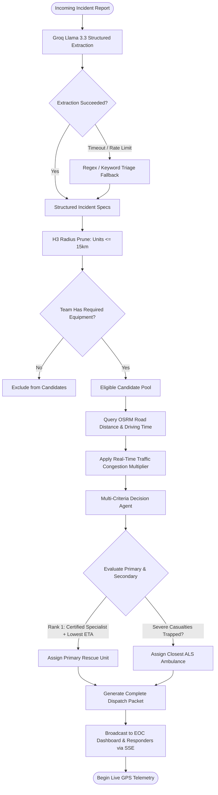

# NIRVANA: Autonomous Emergency Response Coordinator

[](docs/IMPLEMENTATION.md)
[](docs/IMPLEMENTATION.md)
[](docs/IMPLEMENTATION.md)
[](docs/)

> **NIRVANA** is an ultra-low-latency, AI-driven emergency response coordinator that eliminates human dispatch bottlenecks. It parses unstructured distress calls, cross-references available municipal rescue resources, calculates real-world road network routes, and autonomously dispatches optimal rescue teams in **under 800 milliseconds**.

---

## Navigation & Project Documentation

- **[Technical Implementation Specification](docs/IMPLEMENTATION.md)** — Deep-dive geospatial study (PostGIS vs. H3 vs. Haversine), AI provider benchmarks (Groq vs. Gemini), database models, and phase-wise roadmap.
- **[Contributor Guide & Role Allocation](docs/CONTRIBUTION.md)** — Ownership domains, API interface contracts, local setup, and git workflows for **3 contributors** (Frontend, Backend, AI/Agents).
- **[Autonomous Progress Tracker](docs/PROGRESS_TRACKER.md)** — Dual-mode task tracking dashboard designed for developers and autonomous AI agents (Antigravity, Claude, Cursor) to track real-time progress.

---

## Design Philosophy: "The Rule of 5"

> *"I'd rather have 5 things that work extremely well than slap weather, social media, satellites, blockchain, and quantum computing onto the architecture because the diagram looks cooler."*

In catastrophic emergencies, seconds equal lives. Traditional dispatch systems fail due to bloated feature sets, fragmented telephone chains, and subjective human triage (average 3–7 minute delay). NIRVANA focuses ruthlessly on the **5 mission-critical steps**:
1. **Understand the Emergency** (Structured extraction from chaos).
2. **Find Capable Resources** (Immediate spatial radius pruning).
3. **Know the True Route** (Real-world road graphs & traffic, not straight-line math).
4. **Make the Call** (Multi-criteria autonomous dispatch with deterministic fallback).
5. **Track to Resolution** (Real-time telemetry and command center synchronization).

---

## System Architecture

NIRVANA connects a real-time reactive frontend dashboard with an Express microservice backend, an ultra-fast Groq LLM inference layer, and Open Source Routing Machine (OSRM) road graph services:

```mermaid
flowchart TB
    subgraph Client_Layer ["🖥️ Presentation Layer (React + Vite + Leaflet)"]
        UI_Intake["Emergency Intake Portal<br/>(Text / Voice / 1-Click Disasters)"]
        UI_Map["Interactive Tactical Map<br/>(OSM Dark Tiles + Custom Unit SVGs)"]
        UI_Dispatch["AI Dispatch Recommendation<br/>(Triage Badges + Reasoning Log)"]
        UI_Telemetry["Live Fleet Status Sidebar<br/>(Real-Time SSE Subscriber)"]
    end

    subgraph API_Layer ["⚡ Backend Gateway & Orchestrator (Node.js + Express)"]
        REST_Ctrl["REST Controllers<br/>(/api/incidents, /api/resources)"]
        Orchestrator["Emergency Dispatch Orchestrator"]
        SSE_Broadcaster["Server-Sent Events (SSE) Hub"]
        Sim_Engine["Telemetry Simulation Engine"]
    end

    subgraph AI_Layer ["🧠 AI Agent Intelligence (Groq & Gemini)"]
        Agent_Extractor["Incident Analysis Agent<br/>(Llama 3.3 70B @ 300 tps)"]
        Agent_Decision["Multi-Criteria Decision Agent<br/>(Resource Optimization)"]
        Fallback_Engine["Deterministic Rule Heuristic<br/>(50ms Failsafe Fallback)"]
    end

    subgraph Geo_Layer ["🗺️ Geospatial & Routing Services"]
        H3_Index["H3 Hex Grid & Haversine<br/>(Sub-1ms Spatial Pruning)"]
        OSRM_Client["OSRM Routing Engine<br/>(Road Distance, Time, Polylines)"]
    end

    subgraph Data_Layer ["💾 Resource Datastore"]
        Store_Memory["InMemory Resource Store<br/>(20 Municipal Rescue Units)"]
        Store_PostGIS["PostGIS Blueprint<br/>(Production Spatial DB)"]
    end

    %% Flow connections
    UI_Intake -->|POST /api/incidents| REST_Ctrl
    REST_Ctrl --> Orchestrator
    
    Orchestrator -->|1. Raw Report| Agent_Extractor
    Agent_Extractor -->|Structured Triage Specs| Orchestrator
    
    Orchestrator -->|2. Query Availability| Store_Memory
    Store_Memory -->|Active Fleet Data| Orchestrator
    
    Orchestrator -->|3. Coordinates| H3_Index
    H3_Index -->|Top 3-5 Candidates| OSRM_Client
    OSRM_Client -->|Road Durations & Polylines| Orchestrator
    
    Orchestrator -->|4. Scored Candidates| Agent_Decision
    Agent_Decision -.->|Timeout / Error| Fallback_Engine
    Agent_Decision -->|Optimal Dispatch Plan| Orchestrator
    
    Orchestrator -->|Update Unit Status| Store_Memory
    Orchestrator -->|5. Broadcast Dispatch| SSE_Broadcaster
    Sim_Engine -->|Live GPS Ticks| SSE_Broadcaster
    
    SSE_Broadcaster -->|Stream Events| UI_Telemetry
    SSE_Broadcaster -->|Route Polylines| UI_Map
    SSE_Broadcaster -->|Triage Details| UI_Dispatch
```



---

## End-to-End Emergency Lifecycle (Sequence Diagram)

This sequence diagram illustrates the lifecycle of a critical incident report from citizen intake to unit dispatch and active road telemetry:

```mermaid
sequenceDiagram
    autonumber
    actor Caller as 🚨 Incident Source (Caller/Sensor)
    participant UI as 🖥️ React EOC Dashboard
    participant API as ⚡ Express Server
    participant AI as 🧠 Groq AI Agent
    participant Geo as 🗺️ H3 & OSRM Engine
    participant DB as 💾 Resource Store
    actor Unit as 🚒 Dispatched Rescue Unit

    Caller->>UI: Reports incident: "Building collapse at 4th & Main, 3 trapped"
    UI->>API: POST /api/incidents (reportText, coords)
    
    rect rgb(30, 41, 59)
        Note over API,AI: Step 1: AI Incident Triage (< 350ms)
        API->>AI: Extract incident type, severity & required capabilities
        AI-->>API: JSON: { type: "structural_collapse", severity: "CRITICAL", capabilities: ["heavy_rescue", "extrication"] }
    end

    rect rgb(15, 23, 42)
        Note over API,Geo: Step 2: Spatial Filter & Road Routing (< 150ms)
        API->>DB: Query available rescue units
        DB-->>API: 20 Active units across city
        API->>Geo: Filter units within 15km (H3 / Haversine)
        Geo-->>API: Top 4 candidate teams
        API->>Geo: Fetch driving distances & route polylines (OSRM)
        Geo-->>API: Durations (Task Force Alpha: 7.2m, Medic 4: 4.5m, Ladder 2: 12.1m)
    end

    rect rgb(30, 41, 59)
        Note over API,AI: Step 3: Autonomous Allocation Decision (< 250ms)
        API->>AI: Rank candidates by equipment capability + traffic-weighted ETA
        AI-->>API: Dispatch Plan: Primary: Task Force Alpha, Secondary: Medic 4
    end

    API->>DB: Update Task Force Alpha & Medic 4 -> DISPATCHED
    API->>Unit: Dispatch alert pushed to vehicle terminal
    API-->>UI: 201 Created (Full Dispatch Plan, ETAs, Polylines)
    
    rect rgb(15, 23, 42)
        Note over API,UI: Step 4: Real-time Telemetry Loop (1Hz)
        loop Every 1 Second (Simulation Tick)
            API->>UI: SSE Event 'telemetry:update' (Vehicle lat/lng, ETA countdown)
            UI->>UI: Animate vehicle marker along OSRM road polyline
        end
    end
```



---

## Autonomous Decision Matrix (Flowchart)

How NIRVANA triages incidents, evaluates team capabilities, factors in road topology, and guarantees safety through deterministic fallbacks:



---

## Step-by-Step Solution Flow

### Step 1: High-Speed Incident Triage (Natural Language to Schema)
- **Input:** Unstructured 911 text, radio transcription, or civilian report:  
  *“Three-car pileup on the highway flyover, one vehicle smoking, multiple people injured and pinned inside.”*
- **Processing:** Groq’s Llama-3.3-70b processes the prompt against a strict Zod JSON schema in $\sim 300\text{ms}$.
- **Output:** 
  - `incidentType`: `traffic_collision`
  - `severity`: `CRITICAL`
  - `requiredCapabilities`: `["hydraulic_extrication", "foam_fire_suppression", "als_medical"]`
  - `victimEstimate`: `3 trapped`

### Step 2: Ultra-Fast Geographic Pruning
- Rather than querying slow external routing engines for all 100+ municipal vehicles, NIRVANA calculates **H3 hexagonal cell rings (Resolution 7)** and **Haversine spherical distance** in memory.
- In $< 1\text{ms}$, fleet assets are pruned down to the **top 3–5 candidate teams** closest to the incident.

### Step 3: Road-Network Routing & Real Traffic Modeling
- Euclidean straight-line distance frequently causes deadly dispatch errors (e.g. assigning a station across an uncrossable river).
- NIRVANA queries the **OSRM Road Network Engine** for the candidate pool to retrieve:
  - Exact driving distance in meters.
  - Realistic road duration over physical street networks.
  - Encoded GeoJSON route polylines for frontend map visualization.
  - Peak-hour traffic friction multiplier ($1.2\times - 1.6\times$).

### Step 4: Autonomous Multi-Criteria Decision
- The **Decision Agent** computes an allocation matrix:
  $$\text{Score} = w_1 \cdot \text{CapabilityMatch} + w_2 \cdot (1 / \text{TrafficETA}) + w_3 \cdot \text{UnitSpecialization}$$
- Selects the primary heavy responder (e.g. Heavy Rescue Tender) and automatically pairs secondary support (e.g. Advanced Life Support Ambulance).
- Generates transparent, human-auditable reasoning for incident commanders.

### Step 5: Real-Time Telemetry & Active Synchronization
- Dispatches are committed to the repository and pushed to connected dashboards over a persistent **Server-Sent Events (SSE)** connection.
- Simulated GPS telemetry ticks advance vehicles along their exact OSRM road paths, providing live ETA countdowns to incident commanders.

---

## 💻 Final Selected Tech Stack

| Domain | Technology | Key Advantage |
| :--- | :--- | :--- |
| **Frontend** | React 18, Vite, TypeScript | Ultra-responsive, reactive dashboard for incident command |
| **Styling** | Tailwind CSS, Lucide Icons | Glassmorphic high-contrast dark theme for 24/7 EOC operations |
| **Maps** | Leaflet, React-Leaflet, OpenStreetMap | 100% free, zero API keys required, lightweight polyline rendering |
| **Backend** | Node.js, Express, TypeScript, Zod | Type-safe REST APIs and unified shared models |
| **AI (Primary)** | Groq (Llama-3.3-70b-versatile) | World's fastest inference (~300 t/s) for sub-400ms dispatch |
| **AI (Multimodal)** | Google Gemini (Gemini 2.0 Flash) | Native visual damage and audio 911 call analysis |
| **Spatial Routing** | OSRM + Uber H3 + Haversine | Real-world road graph navigation with $O(1)$ fast spatial filtering |
| **Database** | In-Memory (Dev) / PostGIS (Prod) | Zero friction for hackathon; enterprise-grade GIS blueprint ready |
| **Streaming** | Server-Sent Events (SSE) | Low-overhead, firewall-friendly real-time telemetry push |

---

## Quickstart Guide

### 1. Clone & Configure
```bash
git clone https://github.com/Jaaiwanth/Nirvana.git
cd Nirvana
```

### 2. Configure Backend Environment
Create `backend/.env`:
```env
PORT=5000
NODE_ENV=development
AI_PROVIDER=groq
GROQ_API_KEY=your_groq_api_key_here
GEMINI_API_KEY=your_gemini_api_key_here
OSRM_BASE_URL=https://router.project-osrm.org
ENABLE_SIMULATION_TICK=true
```

### 3. Start Backend Server
```bash
cd backend
npm install
npm run dev
# Express server runs on http://localhost:5000
```

### 4. Start Frontend Dashboard
```bash
cd frontend
npm install
npm run dev
# React Vite dashboard runs on http://localhost:5173
```

---

## 👥 Contributor Roles & Ownership

This project is built collaboratively by a **3-person engineering team**:

```
├── Person 1: Frontend Engineer  → React UI, Leaflet Map, Telemetry Visuals
├── Person 2: Backend Engineer   → Express API, H3/Haversine, OSRM Client, SSE Hub
└── Person 3: AI & Agent Engineer → Groq/Gemini LLM Prompts, Decision Logic, Scenarios
```

👉 See **[docs/CONTRIBUTION.md](docs/CONTRIBUTION.md)** for detailed responsibility breakdowns, API contracts, and branch rules.  
👉 See **[docs/PROGRESS_TRACKER.md](docs/PROGRESS_TRACKER.md)** for the interactive task board.

---

## Repository Directory Layout

```text
Nirvana/
├── docs/                           # Complete Project Documentation
│   ├── IMPLEMENTATION.md          # Technical Specs & Geospatial/AI Studies
│   ├── CONTRIBUTION.md            # 3-Person Team Roles & Interface Contracts
│   └── PROGRESS_TRACKER.md        # Autonomous AI-Updatable Task Board
│
├── backend/                       # Express.js Server
│   ├── src/
│   │   ├── agents/                # AI Agents (Extractor, Decider, Fallback)
│   │   ├── ai/                    # Groq & Gemini SDK Adapters
│   │   ├── api/                   # Express Controllers & Routes
│   │   ├── data/                  # Mock Rescue Units Seed Data (JSON)
│   │   ├── db/                    # In-Memory Repository & PostGIS DDL
│   │   ├── services/              # Geospatial (H3/Haversine) & OSRM Client
│   │   └── types/                 # Shared TypeScript Interfaces & Schemas
│   └── package.json
│
├── frontend/                      # React (Vite) Dashboard
│   ├── src/
│   │   ├── components/
│   │   │   ├── Dispatch/          # Triage Badges & Recommendation Cards
│   │   │   ├── Intake/            # Emergency Report Form & Scenario Buttons
│   │   │   ├── Map/               # Leaflet Map, SVG Markers & Route Layers
│   │   │   └── Sidebar/           # Fleet Status & Live Incident Feeds
│   │   ├── hooks/                 # Real-time SSE Stream Hooks
│   │   └── services/              # API Client & Polyline Decoders
│   └── package.json
│
├── tests/                         # Testing & Benchmark Suite
│   ├── benchmarks/                # Latency & Throughput Profilers
│   └── scenarios/                 # 10 Standardized Disaster Test Cases
│
└── README.md                      # Project Overview & Architecture Guide
```

---

## License
NIRVANA is licensed under the [MIT License](LICENSE). Built with focus and speed for autonomous emergency coordination.