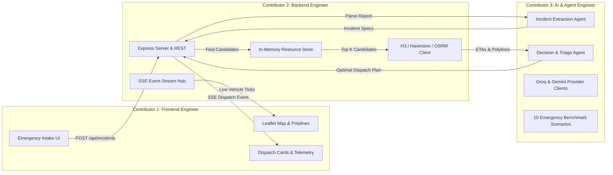

# 🤝 NIRVANA: Contributor Guide & Role Allocation

> **Version:** 1.0.0  
> **Target Audience:** Engineering Team (3 Contributors)  
> **Companion Documents:** [IMPLEMENTATION.md](file:///d:/Personal/projects/Nirvana/docs/IMPLEMENTATION.md) | [PROGRESS_TRACKER.md](file:///d:/Personal/projects/Nirvana/docs/PROGRESS_TRACKER.md)

This guide defines the ownership domains, interface contracts, local development environments, and coordination workflows for the **3 engineers** collaborating on the NIRVANA emergency response platform.

---

## 1. Team Ownership Matrix



| Role | Contributor Domain | Workspace Folders | Core Responsibilities |
| :--- | :--- | :--- | :--- |
| **Person 1** | **Frontend Engineer** | `frontend/src/` | • EOC (Emergency Operations Center) Dashboard layout.<br/>• Interactive Leaflet map with dark theme & custom SVG unit markers.<br/>• Emergency intake panel (preset disaster triggers + custom text input).<br/>• Real-time SSE telemetry subscriber & route animation.<br/>• Audio-visual emergency alert banners and metrics. |
| **Person 2** | **Backend Engineer** | `backend/src/api/`<br/>`backend/src/services/`<br/>`backend/src/db/` | • Express server scaffolding with TypeScript and Zod validation.<br/>• `InMemoryResourceRepository` pre-seeded with 20 municipal rescue units.<br/>• Geospatial service (H3 index filtering + Haversine distance).<br/>• OSRM routing service (fetching driving distance, duration & polylines).<br/>• Server-Sent Events (SSE) broadcaster and `/api/simulate/tick` engine. |
| **Person 3** | **AI & Agent Engineer** | `backend/src/agents/`<br/>`backend/src/ai/`<br/>`tests/scenarios/` | • Groq SDK integration (`llama-3.3-70b-versatile` / GPT-OSS) & Gemini (gemini-3-flash-preview) adapter.<br/>• Incident Extraction Agent (Zod schema for type, severity, capabilities).<br/>• Multi-Criteria Decision Agent (scoring ETA vs. equipment match).<br/>• Deterministic rule-based fallback heuristic engine.<br/>• 10 realistic disaster scenario benchmark test suite. |

---

## 2. Interface Contracts & Parallel Development

To prevent blocking, all 3 contributors work against agreed TypeScript interfaces and mock responses.

### 2.1 Contract Between AI Agent and Backend (`backend/src/types/agent.ts`)
The Backend Engineer passes candidate rescue units to the AI Agent Engineer's module, which returns a strictly validated `AgentDecisionResult`:

```typescript
// AI Agent Inputs
export interface CandidateUnit {
  id: string;
  callsign: string;
  vehicleType: string;
  capabilities: string[];
  equipmentList: string[];
  distanceKm: number;
  drivingDurationMin: number;
  trafficFactor: number;
  routePolyline: string;
}

// AI Agent Output
export interface AgentDecisionResult {
  primaryTeamId: string;
  secondarySupportIds: string[];
  reasoning: string;
  triagePriority: 'P1_CRITICAL' | 'P2_HIGH' | 'P3_MEDIUM' | 'P4_LOW';
  estimatedTimeToArrivalMin: number;
  confidenceScore: number;
  isFallback: boolean;
}
```

> **Contributor 3 Mock Stub:** The AI engineer provides a mock function `mockEvaluateDispatchPlan()` returning realistic responses immediately so Contributor 2 can build the pipeline before LLM keys are configured.

### 2.2 Contract Between Backend and Frontend (`POST /api/incidents`)
The Frontend Engineer can simulate backend responses using this exact JSON shape:

```json
{
  "incidentId": "inc_48102a",
  "status": "DISPATCHED",
  "timestamp": "2026-09-01T22:30:00.000Z",
  "incident": {
    "type": "structural_collapse",
    "severity": "CRITICAL",
    "coordinates": { "lat": 12.9716, "lng": 77.5946 },
    "requiredCapabilities": ["heavy_rescue", "extrication_tools", "als_medical"]
  },
  "dispatchPlan": {
    "primaryTeam": {
      "id": "team_usar_01",
      "callsign": "Task Force Alpha",
      "vehicleType": "Heavy Rescue Tender",
      "distanceKm": 3.42,
      "etaMinutes": 7.2,
      "routeCoordinates": [
        [12.9780, 77.5850],
        [12.9750, 77.5900],
        [12.9716, 77.5946]
      ]
    },
    "secondarySupport": [
      {
        "id": "team_medic_04",
        "callsign": "Medic 4",
        "vehicleType": "ALS Ambulance",
        "distanceKm": 2.10,
        "etaMinutes": 4.5,
        "routeCoordinates": []
      }
    ],
    "reasoning": "Task Force Alpha possesses heavy hydraulic rams and acoustic listening devices. Fastest ETA (7.2 min) among certified USAR teams."
  }
}
```

---

## 3. Local Development Setup

### 3.1 Prerequisites
- **Node.js**: v20.x or higher (`node -v`)
- **Package Manager**: `npm` or `pnpm`
- **Git**: Configured with user email and name
- **API Keys (for Person 3)**:
  - Groq API Key: [https://console.groq.com/keys](https://console.groq.com/keys)
  - Google Gemini API Key: [https://aistudio.google.com/](https://aistudio.google.com/)

### 3.2 Environment Configuration (`backend/.env`)
Copy `backend/.env.example` to `backend/.env`:
```env
PORT=5000
NODE_ENV=development
AI_PROVIDER=groq
GROQ_API_KEY=gsk_your_groq_api_key_here
GEMINI_API_KEY=AIzaSy_your_gemini_key_here
OSRM_BASE_URL=https://router.project-osrm.org
ENABLE_SIMULATION_TICK=true
```

### 3.3 Running the Services

#### Terminal 1: Backend (Person 2 & Person 3)
```bash
cd backend
npm install
npm run dev
# Starts Express server at http://localhost:5000 with tsx hot-reload
```

#### Terminal 2: Frontend (Person 1)
```bash
cd frontend
npm install
npm run dev
# Starts Vite dev server at http://localhost:5173
```

---

## 4. Workflows & Git Collaboration Guidelines

### 4.1 Branching Strategy
All work must happen on dedicated feature branches branched off `main`:
- Frontend Engineer: `feature/fe-<task-name>` (e.g., `feature/fe-leaflet-map`)
- Backend Engineer: `feature/be-<task-name>` (e.g., `feature/be-osrm-routing`)
- AI / Agent Engineer: `feature/ai-<task-name>` (e.g., `feature/ai-groq-extractor`)

### 4.2 Conventional Commit Standard
Commit messages must follow the standard format:
- `feat(fe): add live marker pulse animation on map`
- `feat(be): integrate OSRM road distance and polyline decoding`
- `feat(ai): configure Groq Llama 3.3 70B structured JSON extraction`
- `test(ai): add 10 disaster benchmark scenarios`
- `docs: update progress tracker for FE-102`

### 4.3 Definition of Done (DoD)
Before opening a PR into `main`:
1. Code compiles without TypeScript errors (`npm run build`).
2. ESLint checks pass without warnings (`npm run lint`).
3. No secrets or API keys are committed to Git.
4. Corresponding task in [PROGRESS_TRACKER.md](file:///d:/Personal/projects/Nirvana/docs/PROGRESS_TRACKER.md) is marked as completed.
5. Code tested against mock data or unit test suite.

---

## 5. Daily Sync & Task Handoff Checklist

- [ ] **Morning Standup:** 5-minute alignment on active tasks in [PROGRESS_TRACKER.md](file:///d:/Personal/projects/Nirvana/docs/PROGRESS_TRACKER.md).
- [ ] **Contract Verification:** Confirm no breaking changes to `types/` interfaces.
- [ ] **Integration Verification:** Person 1 tests Person 2's new endpoints; Person 2 tests Person 3's new agent functions.
