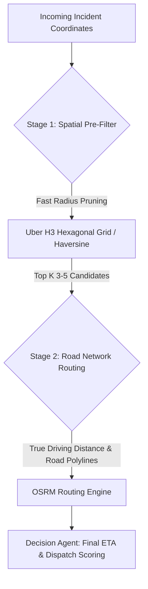
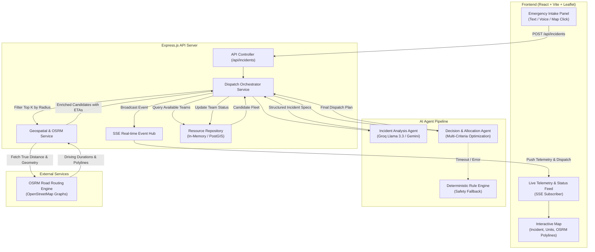
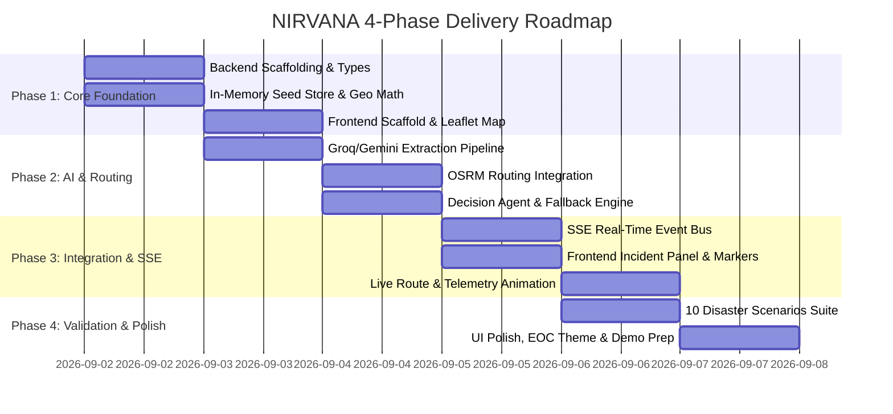

# 🛠️ NIRVANA: Technical Implementation Specification

> **Document Version:** 1.0.0  
> **Status:** Approved Architecture Blueprint  
> **Target Audience:** Engineering Team (Frontend, Backend, AI/Agents)  
> **Companion Documents:** [CONTRIBUTION.md](file:///d:/Personal/projects/Nirvana/docs/CONTRIBUTION.md) | [PROGRESS_TRACKER.md](file:///d:/Personal/projects/Nirvana/docs/PROGRESS_TRACKER.md)

---

## 1. Executive Summary & Core Tenets

**NIRVANA** is an autonomous emergency response coordination system that bridges the gap between chaotic real-world incidents and distributed rescue resources. 

In high-stakes emergencies, traditional dispatch relies on human telephone operators mentally calculating distances, calling multiple stations, and making subjective triage decisions. This causes critical delays (average 3–7 minutes dispatch time). 

NIRVANA reduces this window to **under 800 milliseconds** through an automated, AI-driven pipeline:
1. **Extracts** structured triage requirements from raw natural language or voice reports.
2. **Filters** available rescue units within the incident's geographic sphere.
3. **Calculates** real-world road-network routes and traffic-weighted ETAs.
4. **Executes** multi-criteria autonomous dispatch decisions.
5. **Broadcasts** telemetry and routing plans in real-time to response units and command centers.

### Design Tenets: "The Rule of 5"
> *"I'd rather have 5 things that work extremely well than slap weather, social media, satellites, blockchain, and quantum computing onto the architecture because the diagram looks cooler."*

1. **Sub-Second Execution:** Every component must optimize for latency. From intake to dispatch packet must take $< 1.0\text{s}$.
2. **Deterministic Safety Fallback:** If the LLM provider fails, times out, or hallucinates, a rule-based deterministic heuristic engine immediately takes over.
3. **No Unnecessary External Bloat:** No external cloud services are required to run a full local demo. Free/open components (OSRM, OpenStreetMap, local in-memory store) ensure zero-friction onboarding.
4. **Contract-First Development:** Frontend, Backend, and AI components communicate via strictly typed Zod/TypeScript schemas.
5. **Real-World Fidelity:** Never use straight-line Euclidean distance for dispatch decisions when lives are on the line; road networks, bridges, and traffic choke points determine actual survivability.

---

## 2. Final Selected Tech Stack

| Layer | Technology | Version / Tooling | Rationale & Selection Criteria |
| :--- | :--- | :--- | :--- |
| **Backend Runtime** | **Node.js + Express** | `Node.js v20+`, `Express 4.x`, `TypeScript 5.x`, `tsx` | Ultra-fast event loop, native JSON handling, unified TypeScript types shared across stack, non-blocking I/O for concurrent telemetry and SSE streams. |
| **Frontend Framework** | **React (Vite)** | `React 18+`, `Vite 5.x`, `TypeScript` | Instant HMR, minimal bundle size, component-based dashboard architecture, reactive state for real-time map marker updates. |
| **Styling & Icons** | **Tailwind CSS + Lucide** | `Tailwind v3.4+`, `lucide-react` | Clean glassmorphic emergency operations center (EOC) dark-mode theme, rapid UI iteration, crisp vector iconography. |
| **Mapping & GIS UI** | **Leaflet + React-Leaflet** | `Leaflet 1.9+`, `react-leaflet 4.x` | Zero API key requirement, lightweight (40KB vs 500KB Mapbox GL), native OpenStreetMap tile support, high-performance polyline rendering. |
| **Primary AI Provider** | **Groq (Llama-3.3-70b-versatile)** | `groq-sdk 0.9+` | **Fastest TTFT and inference on the market** (~250-300 tokens/sec). Completes complex structured JSON extraction and decision analysis in $< 400\text{ms}$. |
| **Multimodal AI Provider** | **Google Gemini (gemini-3-flash-preview)** | `@google/genai` or `@google/generative-ai` | Used for processing photo uploads (e.g. fire/structural collapse damage assessment) and audio 911 calls. Unified behind a common provider interface. |
| **Routing Engine** | **OSRM (Open Source Routing Machine)** | Public API / Self-hosted OSRM | Turn-by-turn road network routing, exact driving distances, real route polylines, and realistic traffic-factored ETAs without billing barriers. |
| **Geospatial Index** | **Uber H3 + Haversine** | `h3-js 4.x` | Hexagonal spatial indexing for $O(1)$ radius neighbor filtering and spherical distance validation. |
| **Database (Dev/MVP)** | **In-Memory Store with JSON Seeding** | TypeScript Map / In-Memory Repository | Zero database setup overhead, instant hot-reloading for hackathon demo, deterministic scenario resets. |
| **Database (Production Blueprint)**| **PostgreSQL + PostGIS** | `PostgreSQL 16`, `PostGIS 3.4` (Supabase ready) | Spatial indices (GiST), `ST_DWithin`, ellipsoidal distance calculations on WGS84 for enterprise multi-city scaling. |
| **Real-time Transport** | **Server-Sent Events (SSE)** | Native HTTP/1.1 or HTTP/2 SSE | Unidirectional low-latency event stream from server to dashboard (simpler, more reliable, and lower overhead than WebSockets for telemetry push). |

---

## 3. Deep-Dive Geospatial & Mapping Study

Emergency response dispatching is inherently a geospatial problem. Choosing the wrong spatial approach leads to either unacceptably high compute latency, inaccurate dispatch choices (e.g. sending a unit on the other side of an impassable river), or heavy infrastructure maintenance.

### 3.1 Geospatial Architecture Options Evaluation



#### Option A: PostGIS (PostgreSQL Extension)
- **Mechanism:** Stores geometries (`POINT`, `POLYGON`) with Spatial Reference Identifiers (SRID 4326 for WGS84). Uses Generalized Search Trees (GiST) indexing based on R-trees.
- **Key Functions:** `ST_DWithin(geom1, geom2, distance_meters)`, `ST_Distance(geog1, geog2)`.
- **Strengths:** 
  - Industry gold standard for production GIS applications.
  - Sub-millisecond lookups on millions of spatial rows.
  - Capable of complex polygon containment (e.g., municipal boundary checks, flood zone intersections).
- **Weaknesses:**
  - Requires running a PostgreSQL server with compiled C extensions.
  - Adds infrastructure friction for 3 developers working across different local environments (Windows/macOS/Linux).
  - Spatial distance is still *as the crow flies* unless supplemented with pgRouting (which requires importing complete OpenStreetMap road network graphs).

#### Option B: Geohashing (Standard Geohash vs. Uber H3)
- **Standard Geohash:**
  - Encodes coordinates into hierarchical base-32 string hashes (e.g., `tdr1v7`).
  - *Limitation:* Rectangular bounding boxes cause non-uniform distortion at higher latitudes. Edge discontinuities mean two points 10 meters apart across a boundary line can have completely different prefixes.
- **Uber H3 (Hexagonal Hierarchical Spatial Index):**
  - Projects the earth onto an icosahedron decomposed into nested hexagons.
  - *Advantage 1: Equidistant Neighbors.* Every hexagon has exactly 6 neighbors at identical centroid distances (unlike squares which have 4 edge neighbors and 4 diagonal corner neighbors).
  - *Advantage 2: Constant-Time Proximity.* Finding all teams within $k$-rings of an incident (resolution 7 $\approx$ 1.2km radius per hex) is a pure $O(1)$ bitwise lookup.
  - *Advantage 3: Zero Infrastructure.* Runs entirely in application memory via `h3-js`.

#### Option C: In-Memory Haversine Formula
- **Mechanism:** Computes great-circle distance between two pairs of latitudes and longitudes on a spherical Earth:
  $$d = 2r \arcsin\left(\sqrt{\sin^2\left(\frac{\Delta \phi}{2}\right) + \cos(\phi_1)\cos(\phi_2)\sin^2\left(\frac{\Delta \lambda}{2}\right)}\right)$$
- **Performance:** In Node.js V8 engine, computing Haversine across 500 rescue teams takes **$< 0.15\text{ milliseconds}$**.
- **Strengths:** 100% portable, 0 dependencies, completely transparent math.
- **Weaknesses:** Ignores road topology, one-way streets, bridges, rivers, and traffic congestion.

#### Option D: Road Network Routing Engines (OSRM vs. Google Distance Matrix vs. Mapbox)
- **Google Distance Matrix / Routes API:** Highly accurate real-time traffic, but strict credit card requirements, high billing costs, and rate-limiting during hackathons.
- **Mapbox Directions API:** Clean GeoJSON polylines, requires API token, free tier capped.
- **OSRM (Open Source Routing Machine):**
  - High-performance C++ routing engine using Contraction Hierarchies (CH).
  - Public demo server provides turn-by-turn geometry and driving duration with zero authentication.
  - Self-hostable via Docker if offline execution is required.

### 3.2 Geospatial Comparison Matrix

| Criteria | PostGIS | Uber H3 Index | Haversine Formula | OSRM Routing |
| :--- | :--- | :--- | :--- | :--- |
| **Primary Use Case** | Large-scale spatial persistence | Spatial indexing & radius bucketing | Quick distance approximation | True road travel distance & route |
| **Computation Speed** | $1 - 5\text{ms}$ (indexed) | $< 0.1\text{ms}$ (hash lookup) | $< 0.2\text{ms}$ (500 items) | $30 - 80\text{ms}$ (network call) |
| **Road Topology Aware?** | No (without pgRouting) | No | No | **Yes (Real road graphs)** |
| **Provides Route Polylines?**| No | No | No | **Yes (GeoJSON / Polyline6)** |
| **Setup Complexity** | High (PostgreSQL + PostGIS) | Low (`npm install h3-js`) | Zero (pure math) | Zero (HTTP call to public endpoint) |

### 3.3 Final Geospatial Decision for NIRVANA: The Two-Tier Pipeline
To guarantee both sub-second responsiveness and real-world road fidelity:
1. **Tier 1 (Fast Spatial Pruning):** Filter all available rescue resources within a $15\text{km}$ radius of the incident using **Haversine + H3 Resolution 7**. This reduces 500 fleet assets to the **top 3–5 candidate teams** in $< 1\text{ms}$.
2. **Tier 2 (Road Network & Traffic Routing):** Query **OSRM** simultaneously for the top 5 candidates to retrieve:
   - True driving distance (meters).
   - Base driving time (seconds).
   - Simulated traffic congestion multiplier (e.g., peak hour factor $1.3\times$).
   - Exact road polyline geometry for frontend rendering.

---

## 4. AI Provider Study: Groq vs. Gemini

Emergency dispatch requires extracting structured parameters from unstructured distress calls, followed by complex multi-criteria optimization.

### 4.1 Comparative Analysis

| Feature | Groq (Llama-3.3-70b-versatile) | Google Gemini (gemini-3-flash-preview) |
| :--- | :--- | :--- |
| **Time to First Token (TTFT)** | **$\sim 120 - 180\text{ms}$ (Industry fastest)** | $\sim 450 - 700\text{ms}$ |
| **Inference Speed** | **$\sim 280 - 320\text{ tokens/sec}$** | $\sim 80 - 120\text{ tokens/sec}$ |
| **Structured Output Support** | OpenAI-compatible JSON mode & Tool Calling | Native `responseSchema` with strict types |
| **Multimodal Inputs** | Text only (Llama 3.3 70b) / Llama 3.2 Vision | **Native Vision, Audio & Video streaming** |
| **Context Window** | 128k tokens | 1M+ tokens |
| **Hackathon Free Tier** | High RPM, zero cost on open beta | Generous free tier via Google AI Studio |

### 4.2 Architecture Decision: Unified `IAIProvider` Interface
To leverage Groq's unmatched speed for text reasoning while retaining Gemini's multimodal capabilities, we implement a **Provider Adapter Pattern**:

```typescript
export interface IncidentExtractionResult {
  incidentType: 'structural_collapse' | 'fire' | 'medical_trauma' | 'flood' | 'hazmat' | 'traffic_collision';
  severity: 'CRITICAL' | 'HIGH' | 'MEDIUM' | 'LOW';
  confidenceScore: number;
  extractedLocationName?: string;
  coordinates?: { lat: number; lng: number };
  victimsCount: { estimated: number; trapped: boolean };
  requiredCapabilities: string[]; // e.g. ['heavy_rescue', 'hydraulic_cutters', 'advanced_life_support']
  summary: string;
}

export interface IAIProvider {
  extractIncidentDetails(rawText: string, context?: object): Promise<IncidentExtractionResult>;
  evaluateDispatchPlan(incident: IncidentExtractionResult, candidates: ScoredCandidate[]): Promise<AgentDecisionResult>;
  analyzeMediaIncident?(buffer: Buffer, mimeType: string): Promise<IncidentExtractionResult>;
}
```

- **Default Mode (`AI_PROVIDER=groq`):** Uses Groq's `llama-3.3-70b-versatile` with JSON schema enforcement. Total extraction latency $\approx 350\text{ms}$.
- **Multimodal Mode (`AI_PROVIDER=gemini`):** Uses Gemini (`gemini-3-flash-preview`) for audio 911 calls or emergency scene photo uploads.
- **Failover:** If the active provider returns HTTP 429 or 5xx, the system transparently falls back to the alternate provider, and if both fail, triggers the **Rule-Based Deterministic Engine**.

---

## 5. Database Architecture & Data Models

### 5.1 Repository Pattern (`IResourceRepository`)
NIRVANA implements a clean repository interface so that the application logic never couples directly to storage mechanics:

```typescript
export interface IResourceRepository {
  getAllTeams(): Promise<RescueTeam[]>;
  getAvailableTeams(): Promise<RescueTeam[]>;
  getTeamById(id: string): Promise<RescueTeam | null>;
  updateTeamStatus(id: string, status: TeamStatus, currentIncidentId?: string): Promise<RescueTeam>;
  updateTeamLocation(id: string, location: Coordinates): Promise<void>;
  createIncident(incident: Incident): Promise<Incident>;
  getIncidentById(id: string): Promise<Incident | null>;
  listIncidents(): Promise<Incident[]>;
}
```

### 5.2 Development / MVP: `InMemoryResourceRepository`
- Backed by an in-memory `Map<string, RescueTeam>` initialized from `data/rescue_teams.seed.json`.
- Seed data includes 20 realistic municipal emergency teams across multiple categories:
  - USAR (Urban Search & Rescue) Task Forces
  - Advanced Life Support (ALS) Ambulances
  - HAZMAT Response Units
  - Heavy Extrication Fire Engines
  - Fast-Water Rescue Boats
- Includes a reset API (`POST /api/simulate/reset`) to restore original coordinates and availability between demo runs.

### 5.3 Production Blueprint: PostGIS Schema DDL
When migrating to Supabase or dedicated PostgreSQL:

```sql
-- Enable PostGIS extension
CREATE EXTENSION IF NOT EXISTS postgis;

-- Enum Types
CREATE TYPE team_status AS ENUM ('AVAILABLE', 'DISPATCHED', 'EN_ROUTE', 'ON_SCENE', 'MAINTENANCE');
CREATE TYPE severity_level AS ENUM ('LOW', 'MEDIUM', 'HIGH', 'CRITICAL');

-- Rescue Teams Table
CREATE TABLE rescue_teams (
    id VARCHAR(64) PRIMARY KEY,
    callsign VARCHAR(100) NOT NULL,
    base_station_name VARCHAR(150) NOT NULL,
    vehicle_type VARCHAR(50) NOT NULL,
    status team_status DEFAULT 'AVAILABLE',
    capabilities TEXT[] NOT NULL,
    equipment_list TEXT[] NOT NULL,
    current_location GEOGRAPHY(Point, 4326) NOT NULL,
    h3_index VARCHAR(15) NOT NULL,
    speed_factor FLOAT DEFAULT 1.0,
    created_at TIMESTAMP WITH TIME ZONE DEFAULT NOW(),
    updated_at TIMESTAMP WITH TIME ZONE DEFAULT NOW()
);

-- Spatial GiST Index for sub-millisecond radius search
CREATE INDEX idx_rescue_teams_location ON rescue_teams USING GIST (current_location);
CREATE INDEX idx_rescue_teams_h3 ON rescue_teams (h3_index);

-- Incidents Table
CREATE TABLE incidents (
    id VARCHAR(64) PRIMARY KEY,
    raw_report TEXT NOT NULL,
    incident_type VARCHAR(50) NOT NULL,
    severity severity_level NOT NULL,
    location GEOGRAPHY(Point, 4326) NOT NULL,
    h3_index VARCHAR(15) NOT NULL,
    required_capabilities TEXT[] NOT NULL,
    victims_estimated INT DEFAULT 1,
    status VARCHAR(30) DEFAULT 'ACTIVE',
    created_at TIMESTAMP WITH TIME ZONE DEFAULT NOW()
);

CREATE INDEX idx_incidents_location ON incidents USING GIST (location);
```

---

## 6. System Architecture & End-to-End Workflow



---

## 7. API Specification & Real-Time Event Contracts

### 7.1 REST Endpoints

#### `POST /api/incidents`
Creates an incident, initiates AI analysis, evaluates nearest teams, and triggers dispatch.
- **Request Body:**
  ```json
  {
    "reportText": "Severe structural collapse at 4th and Main St. At least 3 people trapped under concrete beams.",
    "coordinates": { "lat": 12.9716, "lng": 77.5946 },
    "callerName": "Officer Reynolds",
    "priorityOverride": null
  }
  ```
- **Response (201 Created):**
  ```json
  {
    "incidentId": "inc_90a42f",
    "timestamp": "2026-09-01T22:30:00.000Z",
    "triage": {
      "incidentType": "structural_collapse",
      "severity": "CRITICAL",
      "requiredCapabilities": ["heavy_rescue", "extrication_tools", "als_medical"],
      "victimsCount": { "estimated": 3, "trapped": true }
    },
    "dispatchPlan": {
      "primaryTeam": {
        "id": "team_usar_01",
        "callsign": "Task Force Alpha",
        "vehicleType": "Heavy Rescue Tender",
        "distanceKm": 3.42,
        "etaMinutes": 7.2,
        "routePolyline": "gfo}E..._encoded_polyline..."
      },
      "secondarySupport": [
        {
          "id": "team_medic_04",
          "callsign": "Medic 4",
          "vehicleType": "ALS Ambulance",
          "distanceKm": 2.10,
          "etaMinutes": 4.5
        }
      ],
      "reasoning": "Task Force Alpha selected: possesses required heavy extrication pneumatic rams and concrete cutters. Lowest traffic-adjusted ETA (7.2 min) among certified USAR teams."
    }
  }
  ```

#### `GET /api/resources`
Returns the status, capabilities, and coordinates of all fleet units.

#### `POST /api/simulate/tick`
Advances simulated vehicle positions along their active OSRM polylines by $\Delta t$ seconds and emits SSE updates.

#### `POST /api/simulate/reset`
Resets all teams to their default base stations and sets status to `AVAILABLE`.

### 7.2 Real-Time Event Stream (`GET /api/events`)
Clients open a persistent Server-Sent Events (SSE) connection. The server publishes typed events:

1. `incident:created` - Emitted immediately when report is received.
2. `incident:analyzed` - Emitted when LLM extracts triage specifications.
3. `team:dispatched` - Emitted with the final dispatch plan, target route polyline, and assigned units.
4. `telemetry:update` - Emitted every $1\text{s}$ during simulation with current vehicle `(lat, lng)`, remaining distance, and updated ETA.
5. `incident:resolved` - Emitted when the rescue team reaches the scene.

---

## 8. Phase-Wise Implementation Roadmap



### Phase 1: Core Foundation & Mock Datastore (Days 1–2)
- Set up Node.js Express TypeScript backend with Zod validation.
- Populate `rescue_teams.seed.json` with 20 municipal emergency units.
- Implement `InMemoryResourceRepository` and Haversine distance calculator.
- Initialize React + Vite frontend with Tailwind CSS and Leaflet base map.

### Phase 2: AI Reasoning & Real Routing Engine (Days 2–3)
- Integrate `groq-sdk` with Llama-3.3-70b and structured JSON output prompts.
- Implement Google Gemini (`gemini-3-flash-preview`) fallback adapter.
- Connect OSRM public API to fetch real driving distances and GeoJSON polylines.
- Implement the Multi-Criteria Decision Agent and the rule-based safety fallback.

### Phase 3: Interactive Dashboard & Live Telemetry (Days 3–4)
- Implement Server-Sent Events (SSE) server on `/api/events` and frontend subscriber.
- Build the Emergency Intake Panel with quick-scenario triggers.
- Render incident location, custom SVG team markers, and dynamic route polylines on Leaflet.
- Implement the simulation tick generator to animate vehicles moving toward the incident.

### Phase 4: Stress Testing, Scenarios & Demo Polish (Day 5)
- Validate 10 distinct emergency scenarios (building collapse, industrial chemical spill, highway pileup, apartment fire, flash flood, cardiac arrest, etc.).
- Benchmark end-to-end latency to ensure $< 800\text{ms}$ execution.
- Final UI aesthetic review: high-contrast dark mode, glassmorphism, responsive status badges, and audio-visual alerts.
