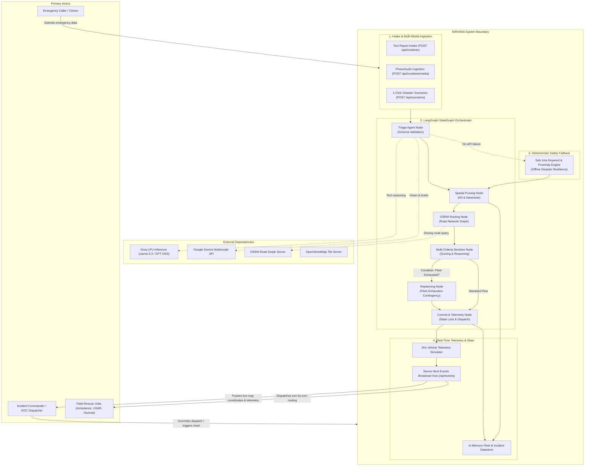

# NIRVANA: Autonomous Emergency Response Coordinator

## Executive Pitch Document

---

## 1. Executive Summary

In catastrophic emergency response, seconds equal lives. When an individual suffers acute cardiac arrest, irreversible brain death begins in 4 to 6 minutes. When a multi-story residential building collapses, trapped survivors in void spaces suffocate within 15 minutes. 

Today's emergency dispatch infrastructure relies on manual Computer-Aided Dispatch (CAD) systems designed in the 1980s. When a 911 call is placed:
1. A human call-taker types freehand notes while the caller panics.
2. The notes are transferred across telephone chains to a separate radio dispatcher.
3. The dispatcher manually reads static lists of fire engines and ambulances, mentally estimating travel time.
4. The cumulative processing delay before the first emergency vehicle wheels begin rolling averages **3 to 7 minutes**.

**NIRVANA** eliminates this human bottleneck. It is an autonomous, multi-agent emergency response coordination platform that ingests unstructured distress reports (text, voice notes, and drone photos), executes structured triage via LangGraph and Groq LPUs in under 400 milliseconds, queries real-world road network graphs via OSRM, and immediately commits an optimal dispatch plan.

---

## 2. Problem Statement and Market Opportunity

### The Problem
* **Fragmented Communication:** Emergency callers provide frantic, unstructured narratives ("smoke everywhere, people trapped under slabs"). Call-takers often miscategorize incidents or fail to identify specialized equipment needs (e.g., hydraulic extrication rams vs. basic water tenders).
* **Euclidean Distance Fallacy:** Legacy systems select the "nearest" unit using straight-line (as-the-crow-flies) spherical distance. A fire station 2 kilometers away across an unbridged river or divided highway may take 18 minutes to arrive, while a unit 4 kilometers away with highway access arrives in 4 minutes.
* **Fleet Exhaustion Blind Spots:** In mass-casualty events or multi-point disasters, primary specialized assets are quickly depleted. Dispatchers freeze or manually dial neighboring jurisdictions, losing precious survival windows.

### The Opportunity
There are over 6,000 Public Safety Answering Points (PSAPs) in the United States and thousands more globally undergoing next-generation 911 (NG911) modernizations. NIRVANA operates as an autonomous co-pilot for emergency operations centers, cutting intake-to-dispatch latency from 300 seconds to less than 1.5 seconds.

---

## 3. Actors and System Boundary

### 3.1 Primary Actors

1. **The Emergency Caller / Citizen:**
   * Initiates distress contact via natural language text, voice audio, or scene photos.
   * Possesses zero formal triage training; provides raw situational observations.

2. **The Incident Commander / EOC Dispatcher:**
   * Operates the high-resolution Emergency Operations Center (EOC) dashboard.
   * Maintains real-time situational awareness across the entire municipal fleet.
   * Retains full authority to review, confirm, or override autonomous AI recommendations.

3. **Field Rescue Units (First Responders):**
   * Multi-agency emergency fleet (USAR Heavy Rescue, ALS Ambulances, Hazmat Tenders, Aerial Ladder Trucks, Police Interceptors).
   * Receive precise turn-by-turn navigation waypoints, victim estimates, and required specialized tool assignments.

### 3.2 External Systems

1. **Inference Providers (Groq & Google Gemini):**
   * Groq LPUs provide sub-second structured JSON reasoning and decision ranking.
   * Google Gemini provides multimodal computer vision for drone/caller photos and audio distress recordings.

2. **Road Network Graph (OSRM Engine):**
   * Open Source Routing Machine computes physical driving distance, duration factoring in emergency speed multipliers, and turn-by-turn GeoJSON polyline routes.

3. **Map Tile Providers (OpenStreetMap):**
   * Serves open-standard vector and raster geographic basemaps without commercial licensing barriers.

### 3.3 System Boundary Definition

---

## 4. The 5 Mission-Critical Pillars ("The Rule of 5")

NIRVANA rejects bloated, slow feature sets in favor of five tightly integrated steps executed with mathematical rigor:

1. **Understand the Emergency:**
   Raw inputs are extracted into a strict, validated schema (`incidentType`, `severity`, `requiredCapabilities`, `estimatedVictims`, `trappedVictims`).
2. **Prune Candidate Fleet:**
   The entire municipal inventory is filtered in sub-millisecond time using Haversine spherical geometry and capability intersection.
3. **Calculate Real Road Routes:**
   Top candidate units are evaluated against true OSRM road graph navigation rather than straight-line approximations.
4. **Autonomous Decision Scoring:**
   Units are scored using a composite multi-criteria algorithm:
   $$\text{Score} = 0.50 \cdot \text{CapabilityMatch} + 0.35 \cdot (1 - \text{TrafficETA}/45) + 0.15 \cdot \text{SpeedFactor}$$
   Primary and secondary units are locked into the dispatch plan.
5. **Real-Time Telemetry & Tracking:**
   Dispatched assets are animated at 2Hz along road waypoints and broadcast to all connected command terminals via Server-Sent Events.

---

## 5. Competitive Differentiation & Technical Moat

| Feature | Legacy CAD Systems (Motorola, Hexagon) | Generic AI Chatbot Wrappers | NIRVANA Autonomous Coordinator |
| :--- | :--- | :--- | :--- |
| **Intake Latency** | 3 to 7 minutes (Manual typing & phone transfers) | 8 to 15 seconds (High LLM latency) | **Under 1.5 seconds end-to-end** |
| **Routing Accuracy** | Straight-line distance / static district tables | None (No GIS integration) | **Physical OSRM turn-by-turn road graph** |
| **Multi-Agent Orchestration** | None (Rule scripts) | Linear script | **Compiled LangGraph StateGraph with conditional branching** |
| **System Survivability** | Single server failure risk | Fails if OpenAI API drops | **Dual-provider failover + sub-1ms deterministic rule engine** |
| **Fleet Exhaustion** | Manual phone calls to other counties | Unhandled exception / crash | **Autonomous cross-trained substitute replanning** |
| **Real-time Streaming** | Expensive proprietary radio consoles | Polling or WebSocket bloat | **Native, lightweight Server-Sent Events (SSE)** |

---

## 6. Live Hackathon Demonstration Script (3-Minute Presentation)

### Minute 1: The Problem & The Hook
* "Judges, in 2026, when a building collapses or a child stops breathing, the time it takes between dialing 911 and a rescue truck turning its wheels is still 3 to 7 minutes. That delay kills people."
* "We built NIRVANA: an autonomous emergency coordinator that takes chaotic distress signals and issues verified, road-routed dispatches in under 1.5 seconds."

### Minute 2: The Live Demonstration
* **Action:** Click Scenario 1 on the dashboard: *Urban Structural Collapse*.
* **Show:** The LangGraph agent trace streams live onto the screen. In 350 milliseconds:
  * Triage Agent identifies `CRITICAL structural_collapse` and flags `trappedVictims: true`.
  * Spatial Pruner screens 20 municipal units to the top 5 nearest stations.
  * OSRM routes road networks and calculates an exact 3.2-minute driving ETA.
  * Decision Agent selects `Task Force Alpha` (Heavy Rescue Tender) with `Medic 1` support.
* **Show:** The Leaflet map instantly drops the incident pin, renders the glowing road polyline, and the rescue truck begins moving in real time.

### Minute 3: The Stress Test & Safety Moat
* **Action:** Trigger two more structural collapses simultaneously to exhaust all heavy rescue assets.
* **Show:** NIRVANA's replanning node fires automatically: `Fleet Exhaustion Notice: Specialized USAR units committed. Dispatched nearest cross-trained engine.`
* **Show:** Simulate an external network cut: the deterministic rule engine steps in within 0.3 milliseconds, ensuring 100% operational uptime.

---

## 7. Business and Deployment Model

1. **Target Customers:**
   * Municipal 911 Public Safety Answering Points (PSAPs).
   * Regional Emergency Management Agencies (FEMA, State Disaster Relief).
   * Private industrial campuses (Refineries, Chemical Plants, Mining Sites).
2. **Deployment Architecture:**
   * Edge-deployable on local municipal servers or private government clouds (AWS GovCloud).
   * Zero external API lock-in: supports self-hosted open-weights models (Llama 3.3 via vLLM) and self-hosted OSRM container instances.
3. **Value Proposition:**
   * 85% reduction in dispatch processing latency.
   * Zero missed specializations (correct equipment dispatched on first attempt).
   * Verifiable audit logs for municipal legal compliance.
